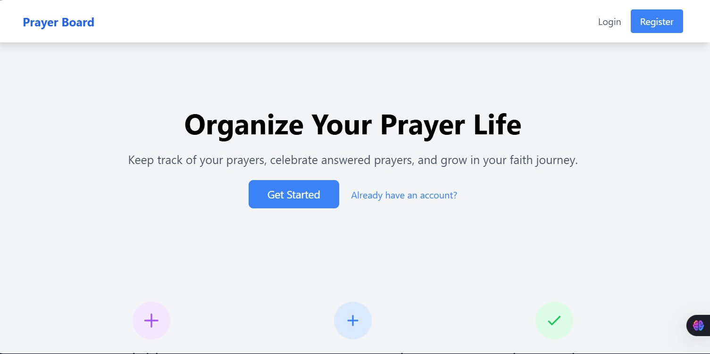
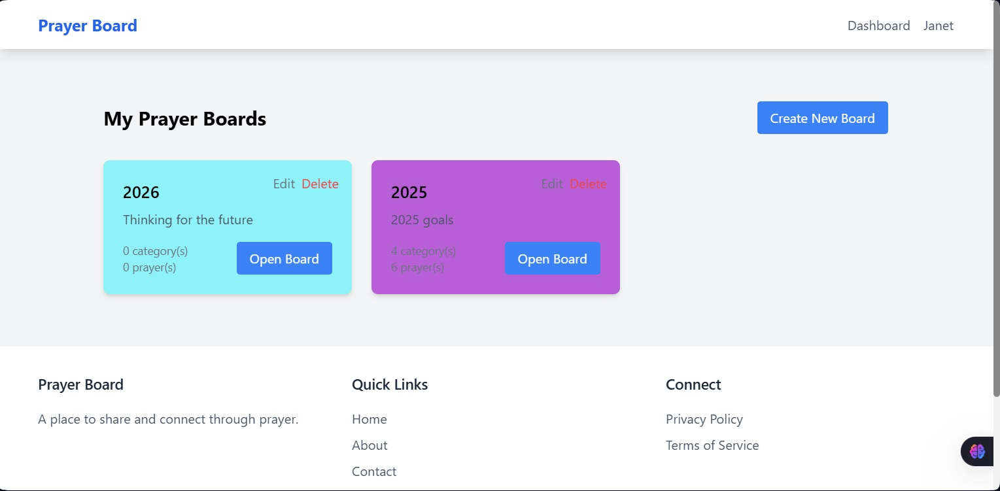
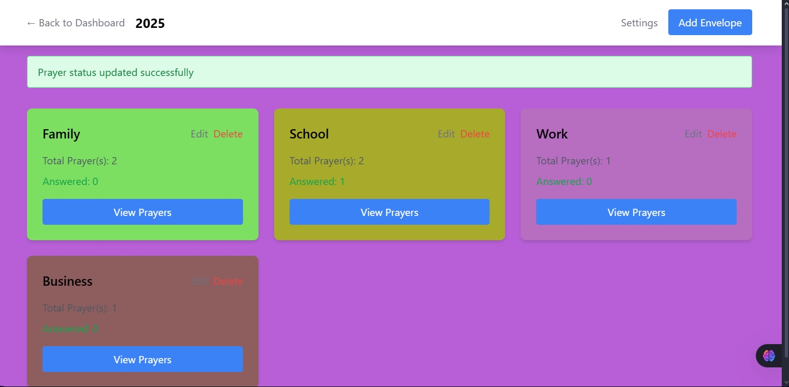

Prayer Board
A simple application where users can create boards, each containing different categories for various aspects of life, and in which prayers can be created.
Tech Stack: PHP, CSS, Javascript, SQL

Features
MySQL Database
Customizable board and category background colors
Drag and drop sorting for easy organization
Getting Started
Follow these steps to clone the project and set it up on your local machine.

Prerequisites
XAMPP installed on your computer.
Cloning the Repository

Import the prayer_board.sql in xamp for the database.

  
 
 
  

NOTE: Feel free to share some enhancement ideas
